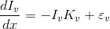
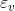
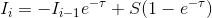
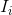
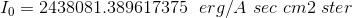

Solving Radiative Transfer Equation to obtain clouds width.
===================================

## Abstract

The transfer of energy in the form of electromagnetic radiation is one of the most interesting phenomena. The fields of application are both diverse and useful. In this project we aim to solve the **radiative transfer equation to calculate clouds thikness** by means of numerical aproximation.

## Introduction

As a beam of energy travels space, it encounters several conditions which modify the radiance in several ways:

1. Absorption
2. Emission 
3. Scattering

Each one of these either increase (+) or decrease (-) the radiation. 
### Clouds 
In meteorology, a cloud is an aerosol consisting of a visible mass of minute liquid droplets, frozen crystals, or other particles suspended in the atmosphere of a planetary body or similar space. Water or various other chemicals may compose the droplets and crystals. On Earth, clouds are formed as a result of saturation of the air when it is cooled to its dew point, or when it gains sufficient moisture (usually in the form of water vapor) from an adjacent source to raise the dew point to the ambient temperature. 
For this modeling we consider the components of a cloud, basically clouds are composed of water particles. Tiny particles of water are densely packed and sunlight cannot penetrate far into the cloud before it is reflected out, giving a cloud its characteristic white color, especially when viewed from the top. Cloud droplets tend to scatter light efficiently, so that the intensity of the solar radiation decreases with depth into the gases. As a result, the cloud base can vary from a very light to very-dark-grey depending on the cloud's thickness and how much light is being reflected or transmitted back to the observer.

## Methodology

To perform this task, we used the **radiative transfer equation** define as:

Where: 
-  are the **absortions** or  the **opacity function** at wavelength **v**.

-  are the **emissions** at wavelength **v**. 

 And it's solution:

 

Where: 
-  is the **Source Function**,

-  is the **optical depth**,

-  is the **specific intensity** at iteration **i**.
In this project, we aim to obtain the thickness of a water cloud by comparing the light that enters with that wich comes out of the cloud.
With this we could mesure other things like water density and thus other properties that could be of potential interest to metheorological forecasting and the aerospace industry.  

### **Initial contidions:**

We start our simulation with the emission of a black-body-like object such as the Sun and calculate the initial emition

- 

Obtained from **astropy.modeling.blackbody.blackbody_lambda**
with 4760 angstrom and 5700 K as parameters.

We would like to solve the equation for the whole visible spectra, but for simplicity we use the color cian; we can locate cian at the given wavelength 4760 Angstrom or 629'816'088'235'294 Hz.

#### **Water and the ES**
As we know, water is transparent, wich means water interactions with light are little in the visible spectra; however these are the interactions we are looking for, in particular, how water interacts in the form of liquid, gas and solid state at the given wavelength. 

For simplicity, we supose clouds do not emit, i.e. Source function is constant and **0** thus removing the right side of the equation. So the only thing we account are the absorptions at the given wavelength. 

## Implementation

We use code writen in pure Python. Python is simple and easy to read wich makes it apropriate for this task.
The code is divided in several components:

- main.py
- funciones.py
- the data

The main module accounts for the calls to functions, defining global parameters (such as the light speed and Boltzman constant) needed for calculations and of course the main loop in wich we integrate the solution. 

The funciones.py module defines the components needed to solve the **RTE** and additional functionality such as data reading.

## Results

## References

- [ref1] Bannister, R. (2007). The Radiative Transfer Equation. [ebook] Available at: http://www.met.reading.ac.uk/~ross/Science/RadTrans.pdf [Accessed 29 Nov. 2019]. 
- [ref2] En.wikipedia.org. (2019). Cloud. [online] Available at: https://en.wikipedia.org/wiki/Cloud [Accessed 29 Nov. 2019]. 
- [ref3] Chaplin, M. (2019). Water absorption spectrum. [online] Www1.lsbu.ac.uk. Available at: http://www1.lsbu.ac.uk/water/water_vibrational_spectrum.html [Accessed 29 Nov. 2019]. 
- [ref4] Rouan D. (2011) Radiative Transfer. In: Gargaud M. et al. (eds) Encyclopedia of Astrobiology. Springer, Berlin, Heidelberg. 
