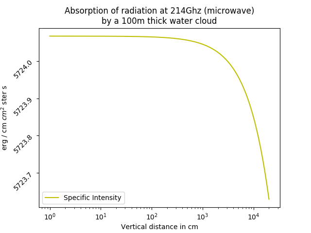

Solving Radiative Transfer Equation to obtain cloud's width.
===================================

## Authors

- Pablo Clemente Moreno (clemnte@comunidad.unam.mx)
- Gilberto Carlos Domínguez Aguilar (gilberto.carlos@comuniadad.unam.mx)
- Angelica Nayeli Rivas Bedolla (angelica.nayeli@comunidad.unam.mx)

## Abstract

The transfer of energy in the form of electromagnetic radiation is one of the most interesting phenomena. The fields of application are both diverse and useful. In this project we aim to solve the **radiative transfer equation to simulate the absorption of radiation by a water cloud at the microwave region (214 Ghz).**

## Introduction

As a beam of energy travels space, it encounters several conditions which modify the radiance in several ways:

1. Absorption
2. Emission 
3. Scattering

Each one of these either increase (+) or decrease (-) the radiation. 
### Clouds 
In meteorology, a cloud is an aerosol consisting of a visible mass of diminutive liquid droplets, frozen crystals, or other particles suspended in the atmosphere of a planetary body or similar space. Water or various other chemicals compose the droplets and crystals. On Earth, clouds are formed as a result of saturation in the air when it is cooled to its dew point, or when it gains sufficient moisture (usually in the form of water vapor) from an adjacent source to raise the dew point to ambient temperature. 
For this modeling we consider the components of a cloud, basically clouds are composed of water particles. Tiny particles of water that are densely packed and sunlight cannot penetrate far into the cloud before it is reflected out, giving a cloud its characteristic white color, especially when viewed from the top. Cloud droplets tend to scatter light efficiently, so that the intensity of the solar radiation decreases according to the gases' depth. As a result, a cloud's base can vary from a very light to very-dark-grey depending on the cloud's thickness and how much light is being reflected or transmitted back to the observer.

## Methodology

To perform this task, we used the **radiative transfer equation** define as:

Where: 
-  are the **absortions** or  the **opacity function** at wavelength **v**.

-  are the **emissions** at wavelength **v**. 

 And its solution:

 

Where: 
-  is the **Source Function**.

-  is the **optical depth**.

-  is the **specific intensity** at iteration **i**.

In this project, we aim to calculate the thickness of a water cloud by comparing the light that enters with the light that comes out of the cloud.
With this we can measure other things like water density and thus other properties that can be of potential interest to meteorological forecasting and the aerospace industry.  

### **Initial contidions:**

We started our simulation with the emission of a black-body-like object such as the Sun and calculate the initial emition obtained from **astropy.modeling.blackbody.blackbody_lambda** with  1.4e7 angstrom and 5700 K as parameters.

For simplicity, we suppose clouds do not emit therefore Source function is constant equal to **0**, hence the right side of the equation was removed. So the only things we have considered were the absorptions at the given wavelength. 

## Implementation

We used code written just in Python. Python is simple and easy to read wich makes it apropriate for this task.
The code is divided in several components:

- main.py
- funciones.py

The main file is where all functions are called and integrated as one and where we defined global parameters (such as the light speed and Boltzmann constant) needed for calculations and of course the main loop in which we have integrated for the solution.
The funciones.py module defines the components needed to solve the RTE.

## Results

As a result of our approximation we got the  following figure:

As we can see, the model works; we can now see how **energy would be absorbed** by the cloud and obtained the following results:
   - initial rayleigh: 5.724067e+03 erg / cm cm^2 ster s
   - outcome rayleigh: 5.723630e+03 erg / cm cm^2 ster s
   - differential: -0.4375105776480268 erg / cm cm^2 ster s

## References

- [ref1] Bannister, R. (2007). The Radiative Transfer Equation. [ebook] Available at: http://www.met.reading.ac.uk/~ross/Science/RadTrans.pdf [Accessed 29 Nov. 2019]. 
- [ref2] En.wikipedia.org. (2019). Cloud. [online] Available at: https://en.wikipedia.org/wiki/Cloud [Accessed 29 Nov. 2019]. 
- [ref3] Chaplin, M. (2019). Water absorption spectrum. [online] Www1.lsbu.ac.uk. Available at: http://www1.lsbu.ac.uk/water/water_vibrational_spectrum.html [Accessed 29 Nov. 2019]. 
- [ref4] Rouan D. (2011) Radiative Transfer. In: Gargaud M. et al. (eds) Encyclopedia of Astrobiology. Springer, Berlin, Heidelberg. 
- [ref5] De la Luz, V., Lara, A., Mendoza, E. and Shimojo, M. (2008). 3D Simulations of the Quiet Sun Radio Emission at Millimeter and Submillimeter Wavelengths. [ebook] Available at: http://www.scielo.org.mx/pdf/geoint/v47n3/v47n3a11.pdf [Accessed 29 Nov. 2019].
